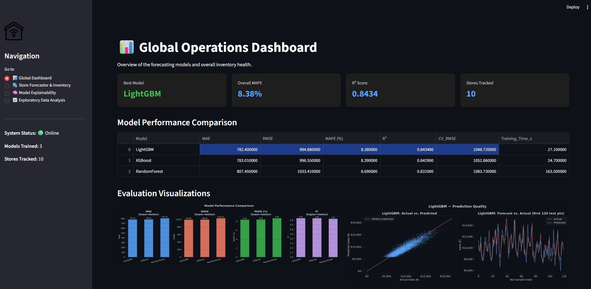
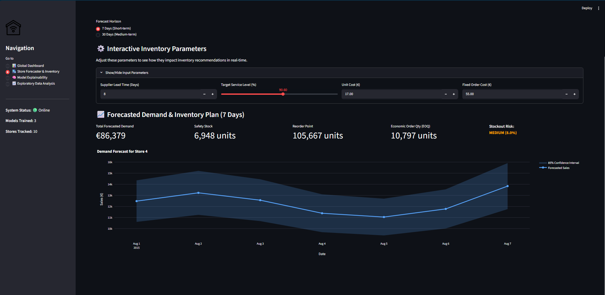

# AI-Powered Fashion Demand Forecasting & Inventory Optimization

<div align="center">


**A production-ready ML system for fashion retail demand planning and inventory optimization**

</div>

---

## 🎯 Overview

This system solves a core retail operations problem: **predicting how much product to stock, when to reorder, and where stockout risk is highest**. It uses the Rossmann Store Sales dataset structure with fashion-retail seasonality to train gradient-boosting and ensemble models, then generates actionable inventory recommendations.

### Key Capabilities

| Capability | Details |
|---|---|
| **Data Generation** | Synthetic Rossmann-style sales (50 stores × 2.5 years) |
| **Feature Engineering** | 25+ features: lags (1/7/14/30d), rolling stats, seasons, promos |
| **Model Comparison** | XGBoost, LightGBM, Random Forest with TimeSeriesSplit CV |
| **Evaluation** | MAE, RMSE, MAPE, R² — auto-selects best model |
| **Forecasting** | 7-day & 30-day rolling multi-step forecasts |
| **Inventory Optimization** | Safety stock, reorder points, EOQ, stockout risk |
| **Explainability** | SHAP global + local feature importance |

---

## 📁 Project Structure

```
AI-Powered-Fashion-Demand-Forecasting-and-Inventory-Optimization/
├── dataset/
│   ├── store.csv                    # Rossmann store metadata (1,115 stores)
│   └── sales.csv                    # Generated synthetic sales data
│
├── src/
│   ├── __init__.py
│   ├── data_preprocessing.py        # Load → clean → merge → encode
│   ├── feature_engineering.py       # Lag, rolling, calendar, seasonal features
│   ├── eda.py                       # 8 EDA visualisation plots
│   ├── model_training.py            # XGBoost / LightGBM / RF + CV tuning
│   ├── model_evaluation.py          # MAE / RMSE / MAPE / R² evaluation
│   ├── forecasting.py               # 7 & 30-day demand forecasting
│   ├── inventory_optimization.py    # Safety stock, EOQ, reorder points
│   └── explainability.py            # SHAP analysis
│
├── outputs/
│   ├── models/                      # Saved .joblib model files
│   ├── reports/                     # CSV evaluation & forecast reports
│   ├── visualizations/              # All PNG charts
│   └── logs/                        # Pipeline execution logs
│
├── config.py                        # Global configuration
├── data_generator.py                # Synthetic dataset generator
├── main.py                          # Pipeline entry point
└── requirements.txt
```

---

## 🖥️ Dashboard UI Preview

**Main Sales Forecasting Dashboard:**


**Inventory Optimization View:**



## ⚡ Quick Start

### 1. Install Dependencies

```bash
pip install -r requirements.txt
```

### 2. Run the Full Pipeline

```bash
python main.py
```

### 3. Run 

This will automatically:
1. Generate a synthetic sales dataset (50 stores, 2013–2015)
2. Preprocess & engineer features
3. Run EDA and save 8 charts
4. Train & compare 3 ML models with TimeSeriesSplit CV
5. Generate 7-day & 30-day forecasts
6. Compute inventory recommendations
7. Run SHAP explainability analysis

**Total runtime: ~3–7 minutes** (depending on hardware)

### 3. CLI Options

```bash
# Skip data generation (if sales.csv already exists)
python main.py --skip-data-gen

# Skip EDA (faster runs)
python main.py --skip-eda

# Skip SHAP (fastest runs)
python main.py --skip-shap

# Skip model training (load existing model)
python main.py --skip-training

# Fewer hyperparameter search iterations (fastest)
python main.py --n-iter 4
```

---

## 🔬 Feature Engineering

| Category | Features |
|---|---|
| **Calendar** | DayOfWeek, Day, Week, Month, Quarter, Year, DayOfYear |
| **Binary Date** | IsWeekend, IsMonthStart, IsMonthEnd |
| **Seasonal** | IsSpring, IsSummer, IsAutumn, IsWinter, IsHolidaySeason |
| **Lag (Sales)** | Sales_lag_1, Sales_lag_7, Sales_lag_14, Sales_lag_30 |
| **Rolling Mean** | Sales_rolling_mean_7, _14, _30 |
| **Rolling Std** | Sales_rolling_std_7, _14, _30 |
| **Promotion** | Promo, Promo2, PromoActive |
| **Holiday** | StateHoliday_enc, SchoolHoliday |
| **Store** | StoreType_enc, Assortment_enc |
| **Competition** | CompetitionDistance, CompetitionDistanceLog, HasCompetition, CompetitionOpenMonths |

---

## 📊 Model Training

All models are tuned using `RandomizedSearchCV` + `TimeSeriesSplit` (5 folds):

```
TimeSeriesSplit Strategy (5 folds):
  Fold 1: Train [0 .. 20%]   → Validate [20..40%]
  Fold 2: Train [0 .. 40%]   → Validate [40..60%]
  Fold 3: Train [0 .. 60%]   → Validate [60..80%]
  Fold 4: Train [0 .. 80%]   → Validate [80..100%]
  (No future data leakage)
```

**Tuned Hyperparameters:**
- XGBoost: `n_estimators`, `max_depth`, `learning_rate`, `subsample`, `colsample_bytree`
- LightGBM: `n_estimators`, `max_depth`, `learning_rate`, `num_leaves`, `subsample`
- Random Forest: `n_estimators`, `max_depth`, `min_samples_split`, `max_features`

---

## 📦 Inventory Optimization

The system computes the following per store × per forecast horizon:

| Metric | Formula |
|---|---|
| **Safety Stock** | `Z × σ_demand × √(lead_time)` |
| **Reorder Point** | `μ_demand × lead_time + Safety_Stock` |
| **Recommended Stock** | `Total_Forecast + Safety_Stock` |
| **EOQ** | `√(2 × annual_demand × ordering_cost / holding_cost)` |
| **Days of Supply** | `Recommended_Stock / avg_daily_demand` |
| **Stockout Risk** | `P(demand > recommended_stock)` under Normal assumption |

Default parameters (configurable in `config.py`):
- Lead time: 7 days
- Service level: 95% (Z = 1.645)
- Annual holding cost: 25% of unit value
- Fixed ordering cost: €50

---

## 📄 Outputs

| File | Description |
|---|---|
| `outputs/models/best_model.joblib` | Best trained model |
| `outputs/models/xgboost_model.joblib` | XGBoost model |
| `outputs/models/lightgbm_model.joblib` | LightGBM model |
| `outputs/models/randomforest_model.joblib` | Random Forest model |
| `outputs/reports/model_evaluation_report.csv` | MAE/RMSE/MAPE/R² comparison |
| `outputs/reports/forecast_7day.csv` | 7-day store-level forecasts |
| `outputs/reports/forecast_30day.csv` | 30-day store-level forecasts |
| `outputs/reports/inventory_recommendations.csv` | Full inventory plan |
| `outputs/reports/shap_feature_importance.csv` | SHAP feature rankings |
| `outputs/visualizations/01_sales_trend.png` | Sales over time |
| `outputs/visualizations/02_monthly_seasonality.png` | Monthly patterns |
| `outputs/visualizations/03_day_of_week_demand.png` | Weekly demand patterns |
| `outputs/visualizations/04_sales_distribution.png` | Sales histogram + log |
| `outputs/visualizations/05_correlation_heatmap.png` | Feature correlations |
| `outputs/visualizations/06_store_type_comparison.png` | Store type comparison |
| `outputs/visualizations/07_promotion_impact.png` | Promo lift analysis |
| `outputs/visualizations/08_quarterly_decomposition.png` | Quarterly trends |
| `outputs/visualizations/09_model_comparison.png` | Model metric comparison |
| `outputs/visualizations/10_actual_vs_predicted.png` | Forecast vs. actuals |
| `outputs/visualizations/11_residual_plot.png` | Residual analysis |
| `outputs/visualizations/12_forecast_7day.png` | 7-day forecast chart |
| `outputs/visualizations/13_forecast_30day.png` | 30-day forecast chart |
| `outputs/visualizations/14_safety_stock.png` | Safety stock by store |
| `outputs/visualizations/15_stockout_risk.png` | Stockout risk scatter |
| `outputs/visualizations/16_inventory_dashboard.png` | Inventory dashboard |
| `outputs/visualizations/17_shap_summary_bar.png` | SHAP bar importance |
| `outputs/visualizations/18_shap_beeswarm.png` | SHAP beeswarm plot |
| `outputs/visualizations/19_shap_waterfall_sample.png` | SHAP waterfall |

---

## 🔧 Configuration

All settings are centralized in `config.py`:

```python
# Adjust number of stores and date range
GENERATION_CONFIG = {
    "num_stores": 50,           # 1..1115
    "start_date": "2013-01-01",
    "end_date": "2015-07-31",
}

# Inventory parameters
INVENTORY_CONFIG = {
    "lead_time_days": 7,
    "service_level": 0.95,
    "unit_cost": 15.0,
    "ordering_cost": 50.0,
}
```

---

## 🏗️ Architecture

```
main.py (Pipeline Orchestrator)
│
├── data_generator.py          # Synthetic data generation
│
├── src/data_preprocessing.py  # Clean, merge, encode
│   └── DataPreprocessor
│
├── src/feature_engineering.py # Feature matrix construction
│   └── FeatureEngineer
│
├── src/eda.py                 # EDA visualisations
│   └── EDAAnalyzer
│
├── src/model_training.py      # CV training + tuning
│   └── ModelTrainer
│
├── src/model_evaluation.py    # Metrics + plots
│   └── ModelEvaluator
│
├── src/forecasting.py         # Multi-step forecast
│   └── DemandForecaster
│
├── src/inventory_optimization.py  # Inventory planning
│   └── InventoryOptimizer
│
└── src/explainability.py      # SHAP analysis
    └── SHAPExplainer
```

---

## 📋 Requirements

- Python 3.9+
- pandas, numpy, scipy
- scikit-learn ≥ 1.2
- xgboost ≥ 1.7
- lightgbm ≥ 3.3
- shap ≥ 0.41
- matplotlib, seaborn
- joblib, tqdm

---

## 🚀 Extending the System

1. **Use real Rossmann data**: Place `train.csv` from [Kaggle](https://www.kaggle.com/c/rossmann-store-sales) in `dataset/` and run with `--skip-data-gen`
2. **Add more models**: Extend `ModelTrainer` with Prophet, LSTM, or N-BEATS
3. **Scale to all 1,115 stores**: Change `num_stores` in `config.py`
4. **Add REST API**: Wrap `DemandForecaster` with FastAPI for real-time serving

---

*Built with Python · XGBoost · LightGBM · scikit-learn · SHAP*